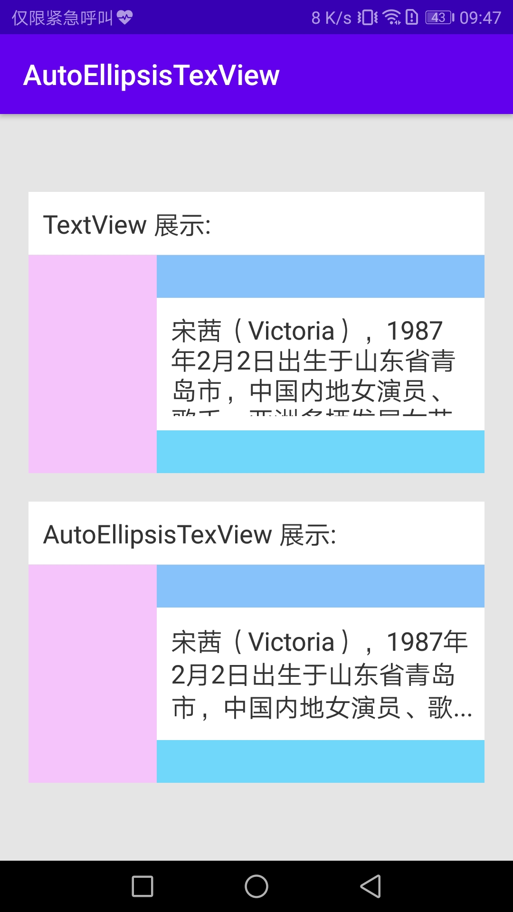

# AutoEllipsisTexView
[](https://jitpack.io/#yangsanning/AutoEllipsisTexView)
[](https://android-arsenal.com/api?level=19)

## 效果预览

| [AutoEllipsisTexView]                      |
| ------------------------------- |
| [][AutoEllipsisTexView]   | |


## 主要文件
| 名字             | 摘要           |
| ---------------- | -------------- |
|[AutoEllipsisTexView]  | 当文本溢出时，显示 ... 的 TextView |

### 1.基本用法 

#### 1.1 xml 静态设置
```android
<ysn.com.view.autoellipsistextview.AutoEllipsisTexView
    android:layout_width="match_parent"
    android:layout_height="93dp"
    ysn:padding="10dp"
    ysn:rowWidth="5dp"
    ysn:text="@string/songqian"
    ysn:textColor="#333333"
    ysn:textSize="18sp" />
```

#### 1.2 控件动态设置
```
autoEllipsisTexView.setText("五碗饭")
```


### 2. 配置属性([Attributes])
|name|format|description|
|:---:|:---:|:---:|
| padding | dimension | 价格线宽度 |
| rowWidth | dimension | 行高 |
| text | string | 文本 |
| textColor | color | 字体颜色 |
| textSize | dimension | 字体大小 |
| ellipsis | string | 末尾省略号 |
| gravity | enum | 溢出后的显示模式 |

### 3.添加方法

#### 3.1 添加仓库

在项目的 `build.gradle` 文件中配置仓库地址。

```android
allprojects {
	repositories {
		...
		maven { url 'https://jitpack.io' }
	}
}
```

#### 3.2 添加项目依赖

在需要添加依赖的 Module 下添加以下信息，使用方式和普通的远程仓库一样。

```android
implementation 'com.github.yangsanning:AutoEllipsisTexView:1.0.0'
```

[AutoEllipsisTexView]:https://github.com/yangsanning/AutoEllipsisTexView/blob/master/AutoEllipsisTextView/src/main/java/ysn/com/view/autoellipsistextview/AutoEllipsisTexView.java
[Attributes]:https://github.com/yangsanning/AutoEllipsisTexView/blob/master/AutoEllipsisTextView/src/main/res/values/attrs.xml
